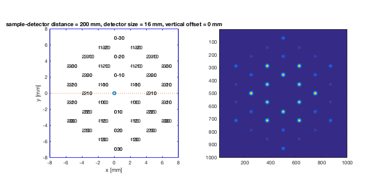

# A Quick Introduction to the Diffraction Library
The diffraction library is a collection of MATLAB scripts for modeling of various diffraction geometries for diffraction of x-rays or electrons from crystals. The library was developed with the Ultrafast Science community in mind, with an emphasis on ease of customization and use. This Quick Intro is targeted towards experienced MATLAB users who wish to quickly learn the key functionalities of the library. It is not intended as an expansive documentation of the library. Further information and examples may be found in the help feature in most of the scripts. The examples below use graphite as the template crystal to showcase the capabilities of the library.

## Build lattice structure

The library currently offers Main Form scripts each major diffraction type currently offered. The minimum neccessary to run a diffraction script is a properly defined lattice structure, probe structure, and (excluding powder diffraction) detector structure and each outputs the desired diffraction information as a table in the Command Window, with the adittional option to output the table in a .txt, .xlsx, .xls, .dat, or .csv file for post-simulation data processing.

The following is what is needed to define graphite:

Lattice.Symbol = 'C'   % The program will parse through this variable to any other elements

Lattice.Type = 'hexagonal' % The amount of information needed depends on the Lattice Type. For hexagonal, we only need the a and c lengths.

Lattice.a = 2.4560

Lattice.c = 6.6960

Lattice.AtomicPositions = [0 0 0 ; 0 0 1/2 ; 1/3 2/3 0 ; 2/3 1/3 1/2] %The Atomic Positions in the unit cell.

save('graphite.mat', 'Lattice') %Saving the above as graphite.mat

All other Lattice variables, if not defined in the structure file, are calculated by the library.

## Define probe

The probe is the incident beam. It may currently be defined as either 'xrays' or 'electrons', along with it's Energy. For non-coplanar diffraction, there is also a geometry and grazing angle variable, properly labeled in the main form scripts of their respective diffraction types.

Probe.Type = 'xrays'

Probe.Energy = 8048.3 

## Generate powder diffraction

Note: The simulation shown above was generated using the script Main_Form_Powder_Diffraction.m

Main_Form_Powder_Diffraction.m outputs two figures. The first, shown above, is an Intensity vs 2*Theta plot for the given parameters. The second (not shown) is a scatter plot lacking the multiplicity term as to see the individual contributions of single planes in contrast to the summation of the family of planes.

## Simulate non-coplanar pattern/data

The library is capable of simulating geometrical patterns such as the one shown below for grazing incidence x-ray diffraction off a crystal. Here, one sees both the brightness and position of the possible diffraction pattern over a range of miller indices for the given detector parameters of a graphite crystal with a 001 normal.

Additional Inputs:

Lattice.Normal = [0 0 1]

Probe.DiffractionGeometry = 'noncoplanar'

Probe.psi = 0.1

Detector.Shape = 'square' %May be square or circle

Detector.Size = 40 %mm

Detector.SpotFWHMx = 2

Detector.SpotFWHMy = 2

Detector.DistanceToSample = 50 

Detector.Offset = [0 20]

Each of these parameters may be easily changed in the Main form for this diffraction type.

Note: The simulation shown above was generated using the script TestScripts/Graphite_GeometricalSimulation_noncoplanar.m 

## Simulate non-coplanar diffraction from crystals with preferred orientation

## Calculate exit angles for non-coplanar diffraction from single-crystals

## Simulate diffraction pattern in Transmission Election Microscopy.

The library is capable of simulating geometrical patterns such as the one shown below for TEM diffraction off a crystal with the same structures from the non-coplanar example, with the following major change:

Probe.Type = 'electrons'

## Visualize the lattice structure
As a diagnostic tool, one may also generates a 3D rendering of an inputted lattice structure such as the one shown below for a sodium cloride crystal. 

Note: The model shown above was generated using the script Diffraction/VisualizeCrystal.m

