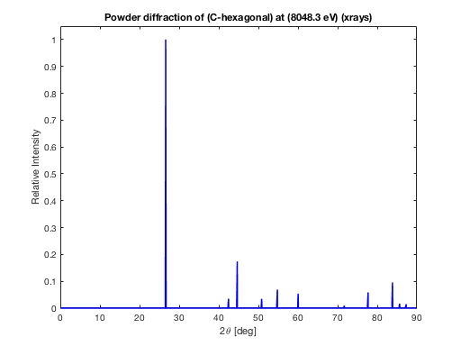

# Diffraction
Collection of MATLAB scripts for modeling of interaction between crystals and x-rays or electrons. Developed with the Ultrafast Science community in mind, with an emphasis on ease of use and ease of customization. Most scripts also include Help functions with examples. Among the main capabilities of the scripts:

- Calculating basic properties of crystals such as planar distances, scattering vectors, geometrical structure factors, etc.

- Modeling of various diffraction geometries such as powder diffraction, coplanar symmetric diffraction, coplanar asymmetric diffraction, non-coplanar diffraction.

Note: The simulation shown above was generated using the script Main_Form_Powder_Diffraction.m

- Simulating geometrical diffraction patterns such as the one shown below for grazing incidence x-ray diffraction off a graphite crystal. 

Note: The simulation shown above was generated using the script TestScripts/Graphite_GeometricalSimulation_noncoplanar.m 

- Simulating geometrical diffraction patterns such as the one shown below for electron transmission diffraction off a graphite crystal.

Note: The simulation shown above was generated using the script Main_Form_GeometricalSimulation_tem.m

- Generates a 3D rendering of an inputted lattice structure such as the one shown below for a sodium cloride crystal. 

Note: The model shown above was generated using the script Diffraction/VisualizeCrystal.m

- Main_Form master scripts for use of use for each major diffraction type currently offered.

- Outputs desired diffraction information as a table in the Command Window, with the adittional option to output the table in a .txt, .xlsx, .xls, .dat, or .csv file for post-simulation data processing.

- Compatible with GNU Octave